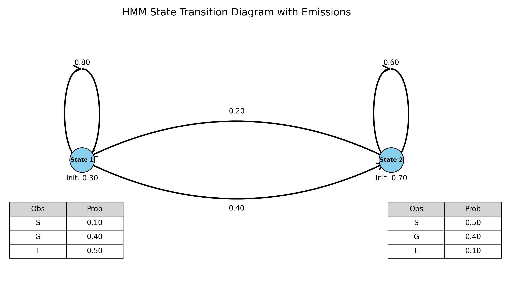
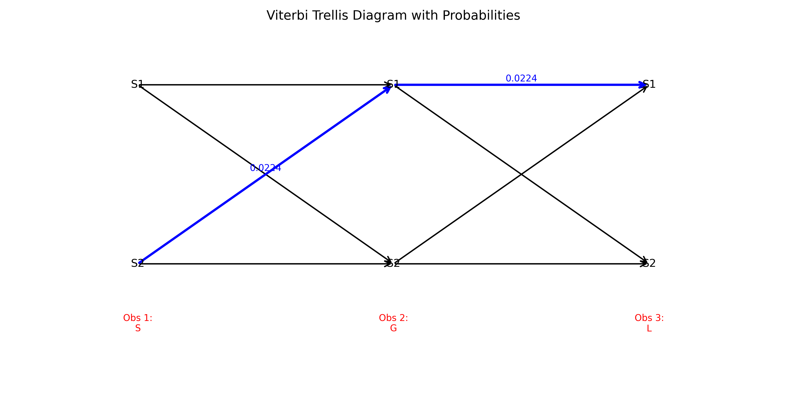

# Hidden Markov Models (HMM) Implementation and Analysis

This project demonstrates the implementation and analysis of Hidden Markov Models (HMMs) through a series of tasks. The tasks cover fundamental HMM concepts, including state transitions, emission probabilities, likelihood calculations, and practical applications such as sequence prediction and model comparison.

## Project Structure

The project consists of four Python scripts, each addressing specific aspects of HMMs:

1. **`task3-1.py`**: Basic HMM operations, including visualization of state transitions, direct likelihood calculation, and the forward algorithm.
2. **`task3-2.py`**: Implementation of the Viterbi algorithm for finding the most likely state sequence and visualization of the Viterbi trellis.
3. **`task3-3.py`**: Application of HMMs to a dice game scenario, including sequence generation, state prediction, and likelihood computation.
4. **`task3-4.py`**: Temperature monitoring using Gaussian HMMs with 2-state and 3-state models, including model comparison using AIC and BIC.

## Key Features

### 1. Visualization of HMM Components
- **State Transition Diagrams**: Graphical representation of state transitions and emission probabilities.
- **Trellis Diagrams**: Visualization of state sequences and observations over time.

### 2. Likelihood Calculations
- **Direct Likelihood**: Enumeration of all possible state paths to compute the probability of an observation sequence.
- **Forward Algorithm**: Efficient computation of observation sequence likelihood using dynamic programming.

### 3. State Sequence Prediction
- **Viterbi Algorithm**: Determination of the most likely state sequence given an observation sequence.
- **HMM Learning**: Utilization of the `hmmlearn` library for model fitting and prediction.

### 4. Practical Applications
- **Dice Game**: Simulation of fair and loaded dice states with hidden state prediction.
- **Temperature Monitoring**: Modeling normal and abnormal temperature states using Gaussian HMMs.

### 5. Model Comparison
- **AIC and BIC Metrics**: Evaluation of model fit and complexity for 2-state and 3-state HMMs.

## Usage

1. **Dependencies**:
   - Python 3.11
   - Libraries: `numpy`, `matplotlib`, `networkx`, `hmmlearn`

2. **Running the Scripts**:
   - Execute each script individually to generate visualizations and results.
   - Example: `python task3-1.py` will produce the HMM state transition diagram and likelihood calculations.

3. **Output**:
   - Visualizations are saved in the `pics/` directory.
   - Results are printed to the console, including likelihood values, state sequences, and model metrics.

## Results

- **Consistency Check**: Both direct likelihood calculation and the forward algorithm yield identical results, validating the implementation.
- **Efficiency**: The forward algorithm significantly reduces computational complexity compared to the direct method.
- **Model Selection**: The 2-state HMM is preferred for temperature monitoring based on AIC and BIC scores.

## Visualizations

Below are examples of the generated diagrams:

1. **HMM State Transition Diagram**  
   

2. **Viterbi Trellis Diagram**  
   

## Conclusion

This project provides a comprehensive exploration of HMMs, from theoretical foundations to practical applications. The implementations and analyses demonstrate the versatility of HMMs in modeling sequential data and making predictions based on hidden states.

For further details, refer to the individual script documentation and generated outputs.